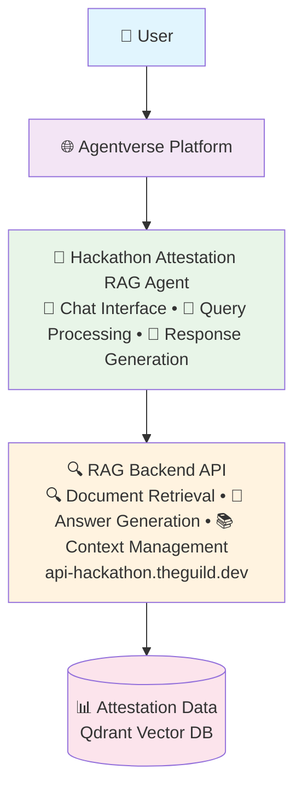

# Hackathon Attestation RAG Agent Architecture

## System Architecture Diagram

## Data Flow

1. **User Query**: User sends a question through Agentverse
2. **Agent Processing**: The RAG agent receives the query and processes it
3. **RAG API Call**: Agent calls the RAG backend API
4. **Vector Search**: RAG backend searches the Qdrant vector database for relevant attestations
5. **Context Retrieval**: Relevant attestation data is retrieved and processed
6. **Answer Generation**: LLM generates an answer based on retrieved context
7. **Response**: Agent formats and sends the response back to the user

## Key Components

- **Agentverse Platform**: Provides the infrastructure for agent deployment and communication
- **RAG Agent**: Handles user interactions and coordinates with the backend
- **RAG Backend API**: Processes queries and manages the retrieval-augmented generation
- **Attestation Data Store**: Qdrant vector database containing on-chain attestation events and embeddings
