# Multi-Agent RAG Architecture

## System Architecture Diagram

```mermaid
graph LR
    User[👤 User] --> ASIOne[🌐 ASI One<br/>💬 Online Chat Interface • 🔍 Agent Discovery • 🤖 Agent Routing]
    ASIOne --> Agentverse[🌐 Agentverse Platform]
    Agentverse --> RAGClient[🤖 RAG Client Agent<br/>💬 Chat Interface • 🔎 Query Processing • 📝 Response Generation]
    RAGClient --> RetrievalAgent[🔍 Retrieval Agent<br/>🔍 Context Retrieval • 📊 Data Processing • 💾 Caching]
    RetrievalAgent --> RAGAPI[🌐 RAG Backend API<br/>🔍 Document Retrieval • 🧠 Answer Generation • 📚 Context Management<br/>api-hackathon.theguild.dev]
    RAGAPI --> DataStore[(📊 Attestation Data<br/>Qdrant Vector DB)]
    
    classDef userClass fill:#e1f5fe
    classDef asiClass fill:#e3f2fd
    classDef platformClass fill:#f3e5f5
    classDef clientClass fill:#e8f5e8
    classDef retrievalClass fill:#fff3e0
    classDef apiClass fill:#fce4ec
    classDef dataClass fill:#f1f8e9
    
    class User userClass
    class ASIOne asiClass
    class Agentverse platformClass
    class RAGClient clientClass
    class RetrievalAgent retrievalClass
    class RAGAPI apiClass
    class DataStore dataClass
```

## Data Flow

1. **User Query**: User sends a question through ASI One chat interface
2. **Agent Discovery**: ASI One discovers and routes to the appropriate RAG client agent
3. **RAG Client Processing**: The RAG client agent receives the query and processes it
4. **Retrieval Request**: RAG client sends a `RetrieveAttestationRequest` to the retrieval agent
5. **Retrieval Processing**: Retrieval agent processes the request and checks cache
6. **RAG API Call**: If not cached, retrieval agent calls the RAG backend API
7. **Vector Search**: RAG backend searches the Qdrant vector database for relevant attestations
8. **Context Retrieval**: Relevant attestation data is retrieved and processed
9. **Response Generation**: Retrieval agent sends `RetrieveAttestationResponse` back to RAG client
10. **Answer Generation**: RAG client generates final answer using retrieved context
11. **User Response**: Response flows back through Agentverse and ASI One to the user

## Key Components

- **ASI One**: Online chat interface that discovers and routes to relevant agents from Agentverse
- **Agentverse Platform**: Provides the infrastructure for agent deployment and communication
- **RAG Client Agent**: Handles user interactions, processes queries, and generates final responses
- **Retrieval Agent**: Specialized agent for context retrieval with caching capabilities
- **RAG Backend API**: Processes queries and manages the retrieval-augmented generation
- **Attestation Data Store**: Qdrant vector database containing on-chain attestation events and embeddings

## Multi-Agent Benefits

- **Separation of Concerns**: Chat interface separated from retrieval logic
- **Caching**: Retrieval agent provides intelligent caching for improved performance
- **Scalability**: Each agent can be scaled independently
- **Modularity**: Easy to modify or replace individual components
- **Specialization**: Each agent optimized for its specific function
